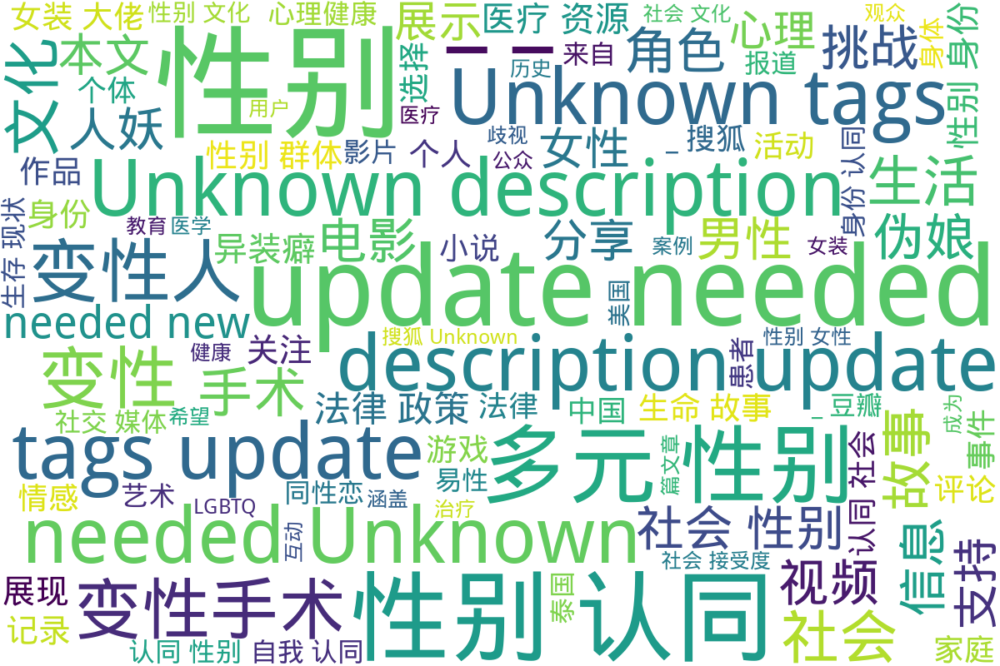

# 跨性别与多元性别网页档案馆

在瞬息万变、审查趋严的中文互联网环境下，许多与跨性别和多元性别议题相关
的网页和信息往往在短期内就难以寻觅。本网站旨在为泛中文社区的多元性别历
史做见证，保存各式各样的网页与资料，让更多人能在未来看到这些重要的记录
与声音。

更多内容可在 <https://transchinese.org> 中搜索与发现。

## 目录

根目录，按照内容与来源分类

总计 2087 篇内容

### 📁 子目录

- [中国新闻网](中国新闻网) (8 篇内容)
  

内容简介

  本目录涉及多元性别主题的多篇报道，内容涵盖变性人、性别表现、儿童性心理等方面，展示了中性化以及性别多元化政策的发展。首先，讨论了韩国变性艺人河莉秀为改户口而向法院申请更改性别的经历，突显了个人与社会之间、公众形象与私生活之间的紧张关系；紧接着是四川泸州监察局调查官员公款观赏人妖表演事件的报道，揭示了公众对社会风气的强烈关注以及官员行为所引发的道德争议。之后，伦敦小学生交换妓女名片现象的报道引起了人们对儿童成长环境的担忧，政府对此的回应显示了社会和法律对性别暴露行为的态度。家庭背景对儿童性取向的影响也是本目录的一个重点，文章结合数据与心理学理论探讨性心理发展的复杂性，反映了社会对个体性取向误解的现状。同时，以日本女星中山美穗因丈夫的性别表现变化而引发的婚姻危机为例，进一步探讨现代婚姻中可能遇到的复杂性。除此之外，关于日本“伪娘”文化的分析展示了社会性别角色的演变，以及其对年轻人价值观的影响。最后，金色海岸变性人登记参选省议员的报导和美国海军解除对变性人服役禁令的消息，展现了多元性别群体在社会政治领域的新进展，体现了对变性人士权益的日渐重视与支持。
  

- [凤凰网](凤凰网) (10 篇内容)
  

内容简介

  该目录来自凤凰网，收录了一系列与多元性别相关的内容。第一篇报道《史上最强伪娘照曝光(组图)》展示了多样的伪娘形象，并引发了对跨性别文化的关注。第二篇讨论了安迪·沃霍尔的艺术生涯，特别是他与性别和边缘文化的关联，反映了他对多元文化表现的探索。这些内容不仅关注个体经历，还讨论了社会对跨性别者文化的接受度。

随后，文章关于泰国一名年仅9岁的小孩打激素的报道，突显了跨性别者在自我认同过程中所面临的挑战和医疗难题。接下来，关于易性癖（变换性别癖）的文章分别讨论了其定义及心理治疗方法，揭示了这一群体所面临的心理困扰和治疗支持。

报道中也涉及了未成年变性手术的法律事件，以及第一位怀孕男性的生活经历，进一步展示了多元性别个体的生存现状与家庭生活。此外，《人妖宿缘未了的爱情故事》电影的讨论，结合了跨性别与爱情主题，展示了这一领域在影视作品中的表现。最后，文章《性别都是浮云：变性人撑起半边天》强调了性别流动性和变性人在社会中的重要性，促使人们重新思考性别认同的界限。
  

- [搜狐](搜狐) (27 篇内容)
  

内容简介

  该目录包含多个关于多元性别和变性人群体的故事与报道，主要分为生命故事、社会现象和法律政策三个方面。首先，包括军事领域变性故事的汉纳·温特伯尔尼，她是英国陆军第一位变性军官，带领超过100名士兵，文章展示了她的内心挣扎与转变，以及在军队中获得的支持和接受；其次，搜狐视频栏目“人妖rose”收录了21个关于人妖rose的生活与工作的视频，探讨了她作为公众人物的影响力。此外，关于变性人兰的故事，影响深远，强调了社会认知的变迁，包括变性手术的个人故事、性别认同的挑战和希望等多样内容。最后，法律与社会环境方面的报道涉及了多位变性人的困境与挑战，以及韩国大法院关于变性人户籍性别更改的历史性判决，为变性人群体的权益保障提供了法律支持。全体故事反映了社会对多元性别的包容进程和对变性人群体的关注，促进了公众对这一特定群体的理解与接纳。
  

- [新浪](新浪) (34 篇内容)
  

内容简介

  本目录包含来自新浪的博客内容，聚焦于多元性别文化和相关社群的表达与经历。包括了豪歌在cosplay圈的活动记录，此项活动展示了该团体在cosplay领域的影响力，共同强调了多元性别表现的艺术形式。广州的一次轻松变装聚会介绍了变装文化的社交平台，适用于多元性别参与者，表明了社会对变装文化的接纳与支持。关于异装癖和伪娘现象的文章反映了个体在性别认同上所面临的挑战与社会期待。接下来的一些故事作品，通过小说形式，描述了双性人和变性人的生存状态和心理挣扎，展现了性别认同对个体的重要性。此外，还讨论了跨性别文化与西方文化的关系，提供了对文化背景的视角和理解。
  

- [未分类](未分类) (1713 篇内容)
  

内容简介

  该目录下包含多个与多元性别相关的文件，涵盖了生动的生命故事、以及多样的文化表现。其中，包含了纪录片《错位：亚洲跨性别者》的相关资料，它通过真实案例展示了亚洲跨性别者的生活挑战与情感经历；此外，还有关于性别转换主题的游戏记录，归纳了多款性转游戏的详细信息，展示了多元性别文化在游戏领域的影响力。除此之外，还有关于心理健康资源的汇总，旨在支持多元性别群体的心理健康需求，以及关于变性手术的规范管理文件，反映了相关医疗资源的规范化进程。该目录还包含了一些文学和艺术方面的阐述，如伪娘小说和与人妖文化相关的讨论，呈现了多元性别群体的文化认同与社会互动的多重面貌。整体而言，这个目录是一个丰富多样的资源库，聚焦于多元性别群体的故事、文化与社会状况，并为相关研究提供了有价值的资料。
  

- [澎湃](澎湃) (21 篇内容)
  

内容简介

  目录《澎湃》包含多篇与多元性别相关的报道和个人故事，涵盖跨性别群体的生存状态、法律权益和社会环境等多个层面的内容。其中包括关于跨性别者的社会议题讨论，包括他们在求职中遭遇的隐性歧视，以及如何通过法律进行维权的报道，例如全国首例跨性别者平等就业权纠纷案的相关新闻。此外，还记录了关于跨性别者的心理状态与医疗需求的讨论，反映了变性人所面临的医疗和法律挑战。通过这些深入的文章和评论，目录展示了跨性别者在中国社会中复杂的生存现状及其对社会的影响，同时引发对性别权利和社会包容性的深入思考。
  

- [网易](网易) (40 篇内容)
  

内容简介

  该目录收录了与多元性别相关的各类内容，涵盖了变性人的生命故事、网络文化现象以及社会新闻报道。首先，包含了一位名为黄宁倩的变性人自述经历，详细描述了她心路历程和在传统婚姻中面临的挣扎。这些故事反映了社会对变性人及其性别认同进程的态度，尤其是家庭的影响。同时，对“女装大佬”这一网络现象进行了讨论，展示了跨性别表达在二次元文化中的表现，并探讨了文化背景下性别表现的多样性。此外，关于变性手术的网友评论展示了个人的过渡经历，强调了跨性别者在日常生活中遇到的挑战与成功。该目录还涵盖了一些与游戏文化相关的讨论，如游戏角色的性别表现及其在社交平台上的接受度，进一步展现了互联网时代性别认同的复杂性。
  

- [腾讯](腾讯) (17 篇内容)
  

内容简介

  该目录包含来自腾讯媒介的一系列关于多元性别的作品与报道，涉及漫画、视频、新闻文章和文学作品等多种形式。《我的伪娘室友》是腾讯动漫发布的一部漫画作品，第九话描述了伪娘角色的生活细节和身份认同的探讨，以及人物间的互动与冲突。台湾影片《迷失安狄》的预告片展示了变性人在社会中的挑战，试图引发公众对多元性别的关注。腾讯新闻中的多篇文章探讨了男性穿女装的文化现象、校园霸凌事件下的性别问题，以及跨性别者的真实故事等，分析了社会、医学与文化对性别认同的影响。此外，目录中还有变装小说的推荐，通过轻松幽默的方式展现变装文化的多样性，反映当代社会对性别流动性的接纳与理解。这些内容共同丰富了关于多元性别的视角与表达，促进了对性别认同和性别角色的深入思考。
  

- [豆瓣](豆瓣) (217 篇内容)
  

内容简介

  目录《豆瓣》下的文件包括各种与多元性别相关的内容，其中有关于《魁拔之书》的读书笔记，探讨了书中呈现的同性恋和跨种族婚姻的道德观念，反映了文化和社会结构对性别认同的影响。另一本漫画《MARS 6》则通过复杂的人物关系引发读者对多样性的思考。此外，还有《性别是条毛毛虫》一书的试读，主要反映了性别的构建及个人在性别认同方面的挣扎，并对传统二元性别划分提出质疑。 其他文件如关于中国同性恋研究的摘录，分析了同性恋题材在中国文化中的发展，探讨了同性恋者所面临的社会压力及法律障碍。此外，何清涟的相关书籍展示了社会与文化对性别变迁的影响，《寂寞之井》则通过细腻的心理描写展现了女同性恋者的孤独与挣扎。
  

### 词云图 { data-search-exclude }

> 目录及摘要为自动生成，仅供索引和参考，请修改 .github/ 目录下的对应脚本、模板或对应文件以更正。

---

## 我们为什么要这样做？

在中文世界的数字环境里，任何有价值的网页或资料都可能因为时效性、
审查或技术变动而随时消失。可能是一篇剖析跨性别医改现状的深度文章，
也可能是描述某位跨性别者在地方政策变动中经历的个人故事，或是表面上
再普通不过的社会报道。  
这些内容，往往最能展现社群的真实面貌和历史脉络。若我们不加以存档，
未来将难以回溯当时所发生的一切。  
我们的目标是长期保存这类网页与资料，为后人提供多元视角的历史基础，
让更多人能探究跨性别与多元性别议题的变迁过程。

---

## 收录范围

- **跨性别与多元性别相关的社会热点**：法案、政策、医疗改革、公众人物事件等网页。  
- **社群焦点内容**：涉及跨性别者权益、歧视事件、成功案例、抗争活动等的报道或评论。  
- **学术或调研文章**：与跨性别社群直接相关的研究成果、学术发布等。  
- **各地区与在地信息**：无论是大型媒体报道，或只是本地刊物或个人博客，只要对跨性别社群具参考价值，都值得保存。  

> 本网站专注于“网页内容”，可能包含各类未经筛选的信息。若想获取更广泛的文献、资源与社群资料，可参阅 [文档与资源主存档库](https://digital.transchinese.org)。  

我们认为，每个人在性倾向、性别身份、性别表达等方面都享有平等的选择权，不应受到污名或歧视。
我们会收录历史中曾出现的错误或歧视性内容，并尽可能对其加以注释。因为即使是负面的记录，也同样是历史的组成部分。  

---

## 使用说明

1. **来源与完整性**： 所有网页与内容均来自公开网络，仅做学习与研究之用，版权归原作者或原发布机构。部分内容可能不完整或已过时，请用户自行甄别。  
2. **公平使用原则**： 若内容未经授权，仅作存档备份用途，不得进行商业化。如有侵权，敬请联系我们。  

---

## 如何提交更多网页资料？

1. **GitHub Pull Request**  
   在本项目的 GitHub 仓库（或相关项目）中提交 PR，将网页链接或内容放入相应的目录。  
2. **网页入口**（开发中）  
   我们计划提供更简便的提交入口，希望更多人一起维护。  

我们会由 AI 与维护者共同完成初步的整理与归档。详细的存档策略可参考  
[中文多元性别数字档案的关键词检索策略](https://transchinese.org/blog/methods).

---

## 免责声明

1. **非官方**  
   本网站仅提供“保留”功能，不代表任何官方立场或权威解释。  
2. **适用场景**  
   仅供学术研究和公益用途，不宜作为法律或医疗参考。  
3. **移除请求**  
   若内容涉及安全风险或当事人提出了合理请求，请通过邮箱或其他渠道与我们联系。

---

## LICENSE

本项目旨在为跨性别群体保存记忆与经验，所有资料均来自互联网公开信息，版权归原作者所有。仅供学习与研究使用，禁止商业用途。  
> **如有问题或侵权疑虑，请通过以下方式联系我们。**

---

## 联系方式

- [Email](mailto:admin@transchinese.org)  
- Telegram 群组：<https://t.me/+QKIMPMhcwJFjOTBl>  
- Telegram Channel：<https://t.me/transchinese>  

如需更多信息或更广泛的多元性别文献资源，欢迎访问我们的其他子项目或友站。  
愿这些网页与资料在未来的岁月里依然被人所见，见证并铭记多元性别者的经历与声音。

---

> **记忆与记录，关乎每一个正在或曾经经历这种处境的人。愿这份存档能成为中文世界跨性别群体的历史印记与未来灯塔。**