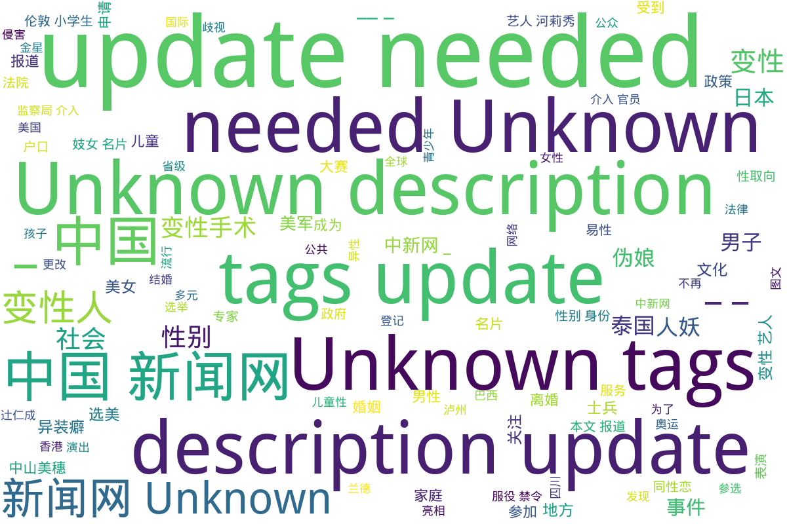

---
search:
  exclude: true
---

# 中国新闻网

本目录涉及多元性别主题的多篇报道，内容涵盖变性人、性别表现、儿童性心理等方面，展示了中性化以及性别多元化政策的发展。首先，讨论了韩国变性艺人河莉秀为改户口而向法院申请更改性别的经历，突显了个人与社会之间、公众形象与私生活之间的紧张关系；紧接着是四川泸州监察局调查官员公款观赏人妖表演事件的报道，揭示了公众对社会风气的强烈关注以及官员行为所引发的道德争议。之后，伦敦小学生交换妓女名片现象的报道引起了人们对儿童成长环境的担忧，政府对此的回应显示了社会和法律对性别暴露行为的态度。家庭背景对儿童性取向的影响也是本目录的一个重点，文章结合数据与心理学理论探讨性心理发展的复杂性，反映了社会对个体性取向误解的现状。同时，以日本女星中山美穗因丈夫的性别表现变化而引发的婚姻危机为例，进一步探讨现代婚姻中可能遇到的复杂性。除此之外，关于日本“伪娘”文化的分析展示了社会性别角色的演变，以及其对年轻人价值观的影响。最后，金色海岸变性人登记参选省议员的报导和美国海军解除对变性人服役禁令的消息，展现了多元性别群体在社会政治领域的新进展，体现了对变性人士权益的日渐重视与支持。

标签: `变性人`, `性别表现`, `儿童性心理`, `河莉秀`, `泸州官员事件`, `伦敦小学生`, `性别多元化`, `家庭因素`, `中山美穗`, `伪娘文化`, `变性人参选`, `美军性别身份政策`

总计 8 篇内容

### 🌐 网页

#### 2016

[www_美军解除变性人服役禁令不再因性别身份区别对待](www_美军解除变性人服役禁令不再因性别身份区别对待.md)

查看摘要

本文报道了美国国防部长卡特于2016年6月30日在五角大楼宣布，解除对变性人军人服役的禁令，标志着美军对待变性人士兵的政策重大转变。根据该政策，变性人士兵将不再因性别身份受到歧视，并能够正常服役。卡特强调，美军的首要任务是保障国家安全，招募标准不应包括性别身份。为了适应这一新政策，美国防部启动了一系列研究和评估，负责改进对变性士兵的管理和医疗服务。统计数据显示，现役美军中约有2500名变性人士兵，这一决定被视为提升LGBT权利的重要努力。

#### 2014

[www_日女星中山美穗被曝离婚因不满老公人妖装扮_-_中国新闻网](www_日女星中山美穗被曝离婚因不满老公人妖装扮_-_中国新闻网.md)

查看摘要

本文报道了日本女星中山美穗与其丈夫辻仁成的婚姻危机，强调了两人之间因辻仁成近年来的一些性别表现变化而产生的矛盾。中山美穗因丈夫的中性化打扮而感到不满，导致夫妻关系紧张，最终走向离婚。文中详细描述了他们的恋爱与婚姻历程，从相识到结婚，再到婚后的幸福生活，以及因育儿分歧和辻仁成外在形象的变化而导致的感情冷淡。文章通过中山美穗缺席婚戒和对家庭的重视，暗示婚姻状况的恶化，进而揭示了现代婚姻中可能遇到的复杂性和多元性别表现所带来的挑战。

#### 2012

[www_日本华媒：是什么让日本“伪娘”泛滥成灾？_-_中国新闻网](www_日本华媒：是什么让日本“伪娘”泛滥成灾？_-_中国新闻网.md)

查看摘要

这篇文章探讨了日本“伪娘”文化的起源和发展，指出这一文化在日本社会日益流行的趋势及其潜在影响力。文章由蒋丰撰写，发源于中国新闻网，发表于2012年8月14日。文章分析了男性“伪娘”热潮的背后原因，引用了相关数据，显示出在日本，越来越多的男性消费者开始关注并参与到女性化的美容和时尚中。文章也提及了“伪娘”一词的演变，从最初的动漫角色发展到今天的社会现象，同时警示如果这样的文化活动过于泛滥，可能会导致社会性别角色的变化，以及年轻人对于传统恋爱和婚姻观念的疏离。

[www_泰国一名变性人登记参选省议员创该国首例_图_](www_泰国一名变性人登记参选省议员创该国首例_图_.md)

查看摘要

本文报道了一位泰国变性人尤兰德（Yonlada Suanyos）在南省省级政府选举中登记参选，成为泰国历史上第一位登记参加省级地方选举的变性人。这一事件的背景是在泰国变性人群体日益受到关注和认可，尤兰德在16岁时完成了变性手术，并且积极参与地方事务，认为自己有资格推动地方的发展。她目前从事珠宝生意和媒体事业，并担任泰国变性妇女协会主席，以其个人经历和专业背景，展现了变性人在社会中的角色和影响力。文章引用了尤兰德的说法，强调她的参选是一种积极的社会举措，旨在促进变性人群体的权益与发展。

#### 2011

[www_家庭因素影响孩子性取向_-_中国新闻网](www_家庭因素影响孩子性取向_-_中国新闻网.md)

查看摘要

该文件讨论了家庭因素对于儿童性取向的影响，强调了性心理的发展受到家庭环境的深刻影响。文章中指出，儿童性侵害的加害者大多是熟人，强调社会对儿童性侵害的关注。性心理障碍，例如同性恋，虽然在社会上受到误解，但实际上是一个正常的性取向，约占人口的5%。此外，文本还分析了导致男性和女性成为同性恋的家庭因素，并指出早恋问题应以开放的态度看待，以支持儿童的情感发展。文章通过数据分析和心理学理论，提供了对儿童性心理发展的深刻洞见。

#### 2009

[www_四川泸州监察局介入调查官员公款看人妖事件_-_中国新闻网](www_四川泸州监察局介入调查官员公款看人妖事件_-_中国新闻网.md)

查看摘要

该文件报道了四川泸州市监察局介入调查一起涉及官员公款看人妖表演的事件。这一事件引发了公众的广泛关注和热议。根据报道，泸县副科级以上干部在出国学习考察期间，被网友曝出与人妖合影，并在公共场所赤身吃饭，形象极为不雅，导致了地方干部形象受到质疑。文章提到了一些具体细节，包括事件最初在网上的传播情况，以及相关党政领导对事件的反应和后续调查。文件同时附有部分截图，展示了事件相关的网络讨论和证据。

#### 2002

[www_变性艺人河莉秀：为了私生活我要改户口！（图）](www_变性艺人河莉秀：为了私生活我要改户口！（图）.md)

查看摘要

本文探讨了韩国变性艺人河莉秀为了私生活而申请更改户口的故事。河莉秀于2002年11月29日向法院提出了更改户口本上性别和姓名的申请，期望将户口本上的性别"男"更改为"女"，并把姓名"李庆烨"改为"李庆恩"。她提到该申请不仅是为了演艺事业，也是为了个人的私生活。法院将在两周内做出是否批准该申请的决定。文中还包括河莉秀的多段相关报道，进一步展示了她在演艺圈及社会生活中的影响和经历。

#### 2000

[www_图文；伦敦小学生流行交换妓女名片](www_图文；伦敦小学生流行交换妓女名片.md)

查看摘要

本文报道了伦敦小学生交换妓女名片的现象，该行为引发了市政当局的强烈关注和困扰。文章指出，伦敦的公共电话亭非法张贴了包含性服务信息及变性人图片的名片，而这些名片现在成为了小学生们的新兴收藏品。报道中提到，年仅6、7岁的小学生积极搜集印有性感女性照片的名片，并积极拨打这些名片上提供的电话号码。市政官员对此表示担忧，并要求政府采取更严厉的措施来解决这一问题，尤其是这些名片的张贴位置显然影响了公众的形象和儿童的成长环境。该文章也引述了当地政府和法律方面的回应，说明在英国，卖淫并不违法，但在公众场所拉客属于犯罪行为。

### 词云图 { data-search-exclude }

> 目录及摘要为自动生成，仅供索引和参考，请修改 .github/ 目录下的对应脚本、模板或对应文件以更正。
