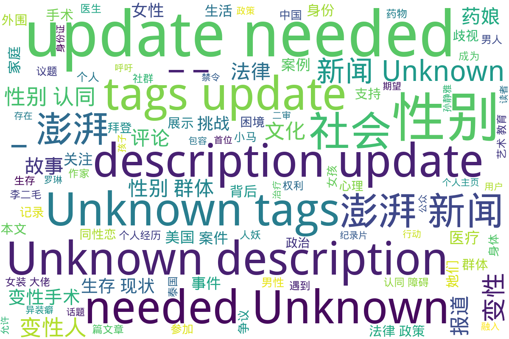

---
search:
  exclude: true
---

# 澎湃

目录《澎湃》包含多篇与多元性别相关的报道和个人故事，涵盖跨性别群体的生存状态、法律权益和社会环境等多个层面的内容。其中包括关于跨性别者的社会议题讨论，包括他们在求职中遭遇的隐性歧视，以及如何通过法律进行维权的报道，例如全国首例跨性别者平等就业权纠纷案的相关新闻。此外，还记录了关于跨性别者的心理状态与医疗需求的讨论，反映了变性人所面临的医疗和法律挑战。通过这些深入的文章和评论，目录展示了跨性别者在中国社会中复杂的生存现状及其对社会的影响，同时引发对性别权利和社会包容性的深入思考。

标签: `跨性别`, `多元性别`, `就业权利`, `法律纠纷`, `社会环境`, `医疗资源`, `性别认同`

总计 21 篇内容

### 🌐 网页

#### 2024

[m_跨性别者](m_跨性别者.md)

查看摘要

本文档汇集了一系列关于跨性别者的报道和故事，主要包括跨性别者在社会、法律及医疗领域中的经历与挑战。第一部分讲述了一位跨性别者因遭受电击治疗而决定提起诉讼的案例，反映了跨性别者面临的医疗暴力问题。第二部分聚焦于美国历史上首位跨性别四星上将的任命，展示了军队在性别身份方面所做出的努力及社会对性别多元化的期待。接下来的报道涉及网飞节目涉嫌歧视跨性别者的抗议行动，以及一起涉及跨性别男性的性侵事件，反映了社会对跨性别者的争议和法律保护的不足。此外，文件还探讨了一位38岁父亲决定转变性别的生活故事，以及荷兰政府对被迫绝育的跨性别者的赔偿问题，展示了国家政策与个人经历之间的矛盾。最后，记录了关于跨性别者生存现状的真实案例与对社会接纳的期望。

#### 2023

[m_全国首例跨性别者平等就业权纠纷案二审开庭，将择期宣判_-_澎湃新闻](m_全国首例跨性别者平等就业权纠纷案二审开庭，将择期宣判_-_澎湃新闻.md)

查看摘要

本文报道了全国首例跨性别者平等就业权纠纷案的二审开庭情况。案件的当事人小马（化名）在经历了性别置换手术后，被其用人单位以“迟到”为由解雇，认为这一行为涉嫌性别歧视。在庭审中，小马的代理律师指出公司辞退的理由不合理，而被告公司则坚持认为解雇是基于员工的多次迟到，符合公司规章制度。此案的前期审理于2019年1月一审驳回了小马的诉讼请求，案件的进展备受关注，小马表示无论结果如何，都希望借此机会引起社会对跨性别者职业平等权的关注。

#### 2021

[m_拜登撤销特朗普禁令，允许变性者在美军服役](m_拜登撤销特朗普禁令，允许变性者在美军服役.md)

查看摘要

这篇文章报道了美国新任总统拜登于2021年1月25日签署行政命令，撤销特朗普政府下颁布的禁止变性者在美军服役的命令。文章指出，拜登在签署命令时强调，所有合法的美国公民都应有权为国家服务，无论其性别认同如何。这项新政策意味着变性军人的身份不会再成为他们服役的障碍，白宫新闻秘书普萨基也表态将重新审查因性别认同被迫退伍的案件。反观特朗普政府的政策曾由于医疗成本等理由禁止变性者服役，并且在其任期内对包括变性人服役及转变性别的军人提出了一系列限制。拜登的命令和言论旨在增强美国军队的多样性及包容性，符合对跨性别者的支持与保护。

#### 2020

[www_80后变性人找工作遇暗门槛：屡被提结婚生子_-_澎湃新闻](www_80后变性人找工作遇暗门槛：屡被提结婚生子_-_澎湃新闻.md)

查看摘要

这篇文章来自澎湃新闻，讲述了80后变性人在求职过程中遭遇的困难，特别是与性别相关的隐性门槛。故事的中心是小马，一个经历变性的个体，她在求职中多次遇到因性别问题而导致的歧视和障碍。文章中提到，全国首例跨性别者平等就业权纠纷案的二审在杭州市中级人民法院举行，这一案件引发了公众对跨性别者在就业市场中所面临困境的关注。小马的经历不仅反映了个人的遭遇，同时也揭示了社会对变性群体的普遍偏见。在评论区，网民们对此事发表了不同的看法，表达了对变性人求职难题的同情，以及对社会性别歧视问题的讨论，显示出这一话题在公众讨论中的重要性与复杂性。

#### 2017

[m_田野调查手记｜去泰国参加跨性别大会，“人妖”多被家庭接受](m_田野调查手记｜去泰国参加跨性别大会，“人妖”多被家庭接受.md)

查看摘要

这篇田野调查手记回顾了作者于2017年9月参加的泰国跨性别大会的经历，以及巴基斯坦跨性别社群的情况。文件中提到松松，这位在巴基斯坦的男同性恋者，因经济困难而成为男性性工作者，并面临家庭与身份认同的矛盾。接着，作者与其他跨性别代表的会议交流，探讨了泰国“人妖”文化与南亚“第三性”的不同，包括家庭接受度与社会支持。在文件中，作者结合个人经历和观察，揭示了跨性别者在医疗与法律上的困境，如巴基斯坦的去势手术难题与泰国的相对开放环境。同时，文中也提到了电影节“倒映”的发展，强调跨性别权利运动的持续推进，展示了国际间的合作与互助。在文字的分析与叙述中，深切表现了跨性别者在不同文化中的生存现实与对话。

#### 2016

[m_2016-05-11发表文章评论](m_2016-05-11发表文章评论.md)

查看摘要

该文档为澎湃新闻上某篇文章评论的整理，主要包含了一系列发表评论的内容。这些评论中涉及了涉及跨性别和同性恋等多种社会议题的讨论。评论者表达了对具体事件的看法，并引出了对更广泛社会问题的探讨，例如跨性别者在社会中的生存状态和权利问题。特别是其中一条评论提到了“跨性别和同性恋简直不敢惹”，显示出社会对跨性别群体的复杂态度。同时还有关于医疗、法律等其他与跨性别者相关的话题的讨论，反映了当时社会环境下的敏感性和公众对待性别多样性的不同看法。这些评论不仅展示了网友们的直观反应，也深刻反映了对跨性别群体的歧视、理解与支持的多重视角。

#### 2015

[m_外围女](m_外围女.md)

查看摘要

本文讨论了跨性别群体与外围女现象的交集，特别关注孙静雅这一人物及其背后的一系列事件。文章通过具体案例分析了跨性别群体在社会中面临的挑战和困境，以及将其置于边缘化状态的法律与社会环境。资料以澎湃新闻多篇报道为基础，数据涉及法律问题、个人生活故事与社会舆论等方面，反映了跨性别人群在社会中遇到的复杂情况，尤其是在卖淫嫖娼相关法律下的生存现状。文件含有多张图片和评论数，显示出该话题在公众中的关注度。

[m_外围女卖淫](m_外围女卖淫.md)

查看摘要

该文件来自澎湃新闻，对跨性别群体中有关外围女及卖淫行为进行了深刻的调查与报道。文件包含多个部分，详细叙述了孙静雅及其背后隐秘的变性“外围女”们。这篇文章揭示了在社会中被边缘化的群体所面临的复杂法律与社会环境，以及公共舆论对她们的影响。在多个事件中，广东警方的查处行动涉及到跨越28个省份，逮捕了过百人，引起社会广泛关注，并引发830条评论的讨论。此外，文章引用多张图片，以进一步呈现事件的真实状态，突显其调查的严谨与深度。

[m_关于澎湃](m_关于澎湃.md)

查看摘要

本文档包含了澎湃新闻的两篇文章，其中一篇探讨了跨性别群体的调查。文章特别提到了孙静雅的故事及她背后的一些变性人群体。通过对这些群体的研究，揭示了跨性别者在社会中的隐秘生活和遇到的困难，体现了她们的生存现状与不为人知的经历。此外，文件中还附有相关的图片和来源链接，增强了文本的可信度与传播效果。属于对跨性别群体生活的深入观察与报道，对理解跨性别者的社会处境及背后的故事提供了宝贵资料。

#### 时间未知，按收录顺序排列

[m_问吧一周精选｜看光头强还是看京剧？诺一妈聊儿童艺术教育](m_问吧一周精选｜看光头强还是看京剧？诺一妈聊儿童艺术教育.md)

查看摘要

该文件是一周精选的问答合集，主要围绕三个主题：儿童艺术教育、跨性别群体的心理状态以及火灾公众责任保险制度。首先，来自澎湃问吧的‘诺一妈’安娜分享了她如何在孩子成长过程中融入艺术教育，并指出中法文化艺术在培养孩子审美能力方面的积极作用。其次，跨性别专家孙蕴珍探讨了跨性别者的成因，强调了先天因素的主导性，并指出变性手术作为处理性别认同障碍的有效手段，认为社会应更包容地对待跨性别者，以促进他们的社会融入。最后，关于火灾公众责任保险的讨论则为读者提供了实际的生活建议，建议民众提前进行财产保险投保以降低火灾风险带来的损失。整体来看，这份文件涉及艺术、心理、保险等多方面内容，展示了社会对孩子教育和跨性别群体的关怀与理解。

[m_跨性别群体](m_跨性别群体.md)

查看摘要

本文档包含关于跨性别群体的多个重要报道和讨论，包括对跨性别者在社会、法律和文化等多方面的探讨。文件中涉及的几个重要主题包括：网红变性者的社会反响，罗琳与跨性别群体之间的争议，以及变装皇后在表演中对自我认同的表达。通过这些案例，我们可以看到跨性别者在现代社会中所面临的挑战和复杂的经验。相关报告还揭示了跨性别者的生存现状，展示了他们的故事与声音，呼吁社会对跨性别族群的理解与尊重。文件收录的各篇文章的发布日期涵盖了2015年到2021年，显示了这一议题的持续关注和发展。

[m_变性女](m_变性女.md)

查看摘要

本文记录了几条关于变性女性的新闻报道，涵盖了她们在日常生活中面临的挑战与权益问题。文章中的第一则报道针对一名变性女性在湖南景点因三八节优惠与工作人员发生争执，最终景点同意给她打对折优惠。这在一定程度上反映了变性人在社会活动中的权益问题与不平等待遇。第二则报道则涉及一起变性女性在酒店按摩时的强奸案件，律师在案件讨论中提出受害者的性别界定问题，突出司法系统在处理跨性别案件时的复杂性与困境。第三则报道则报道了跨性别者为了获得女声而前往南京进行声音手术，尽管花费高达6万，却仍未能达到理想效果，反映了跨性别者在身体过渡过程中所面临的现实挑战与经济负担。整体来看，这些报道揭示了跨性别女性在社会、法律与医疗层面面临的众多现实问题。

[m_变性手术](m_变性手术.md)

查看摘要

本文件包含关于变性手术的多篇报道和实例，涉及不同身份的跨性别者在变性手术中的经历与遇到的问题。文章涵盖了自2016年至2021年间的多个具体案例，既介绍了跨性别者的手术需求与期望，也揭示了医疗过程中存在的法律与伦理问题。报道中提到了一名韩国首位变性军人的去世，以及其他人面临身份证性别更改的困难，涉及到的案例还包括假医生非法行医的事件。卫生与法律之间的紧张关系反映了当前社会中对跨性别者生存现状的复杂态度。

[m_性别认同障碍](m_性别认同障碍.md)

查看摘要

本文探讨了性别认同障碍这一主题，通过几个具体案例反映了跨性别者在生活中面临的挑战与选择。首先，文中讲述了一位38岁的父亲突然希望转变为女性的故事，探讨了他的生活将如何改变，及其家庭面临的困惑与挑战。这引发了读者对跨性别者心路历程的深思。其次，报道了一位9岁跨性别儿童的故事，她自4岁起便坚称自己是女孩，并因此登上《国家地理杂志》。此案例突显了儿童性别认同的重要性，以及社会对跨性别儿童的关注和支持。最后，文中提到了一位变性作家在经历了近30年后重新出版的自述，讨论性别认同观念的演变与整合，揭示了社会对跨性别及变性议题的逐步接受。这些故事与论述交织在一起，构成了对性别认同障碍深刻的社会观察与评论，同时也呼吁社会更多的理解与包容。

[m_药娘](m_药娘.md)

查看摘要

该文档聚焦于‘药娘’这一群体，阐述她们的生活经历、心理挣扎以及家人和社会对她们身份转变的态度。文中披露了药娘们为实现性别认同而经历的过程，面临的挑战，诸如家庭的拒绝和社会的冷漠。同时包括了对话和访谈，揭示了药娘与家庭之间的复杂关系，如‘药娘父母：儿变“女”后的难以承受之重’和‘亮身份证遇尴尬，药娘称结婚生子很奢侈’等侧面反映了她们在社会中的生存现状。此外，涉及药物使用经验及其对身体和心理健康的影响，强调了药娘们的自我探索与反思。整体上，本文档不仅是对个体故事的记录，更是对跨性别群体在社会中生存现状的反思和探讨。

[m_个人主页](m_个人主页.md)

查看摘要

该文件是来自澎湃新闻的个人主页，记录了名为波平顿爵士的用户在平台上的一些动态。主页包含了用户的基本信息，如IP属地为天津、关注、粉丝和获赞数量均为0。接下来是用户的评论记录，其中包括对社会事件的观点和回复。评论中提到了关于社交媒体上的互动，如对快递服务的讨论以及对变性人群体的评论。用户提及变性后改身份证受阻的话题，并参与讨论男性在与女性交往时是否要查身份证的问题。这些评论反映了跨性别者在社会中的生存现状，以及他们在面对法律和社会接受度时所遇到的挑战。

[m_异装癖_-_澎湃新闻](m_异装癖_-_澎湃新闻.md)

查看摘要

本文汇总了几篇关于异装癖的报道，探讨了男孩子穿女装的心理、社会反响以及相关犯罪事件。第一篇文章介绍了一位热爱穿女装的男孩，分享了他的内心世界和感受，试图引导读者理解这一现象背后的真实心态。第二篇文章则探讨了男性伪娘化在中国的现象，报道了公众对此的不同看法，并以具体案例解读此社会现象。第三篇则是关于一起涉及男性男扮女装的纵火案件，案件的离奇性与犯罪动机引发了社会的关注。最后，针对一名在酒吧以女性形象活动的男子被抓的事件，此文也介绍了警方的行动及其背后的社会问题。整体来看，这些内容展示了当前社会对异装癖的复杂态度，以及公众对跨性别文化的逐渐认识与挑战。

[m_这乱世，不被忽悠才是真本事](m_这乱世，不被忽悠才是真本事.md)

查看摘要

该文探讨了当今社会中多个层面的问题，特别是关于文化、政治和艺术的看法。文章通过提及跨性别和其它LGBTQ+相关内容，引出关于所谓“政治正确”的讨论，尤其是在美国文化中如何运用艺术作政治工具。文中举了数个例子，包括一名跨性别女孩参加选美比赛，以及几个艺术作品的背景和出售价格，分析了如何在当代社会中，关于艺术与自由、政治与文化产生了复杂的互动。文章最后呼吁读者保持独立的判断力，不被潮流所左右，强调在这变幻不定的世界中，保持清醒的头脑和文化自信至关重要。

[m_这部纪录片，呈现了中国LGBT族群的抗争_-_澎湃新闻](m_这部纪录片，呈现了中国LGBT族群的抗争_-_澎湃新闻.md)

查看摘要

本文讨论了纪录片《李二毛的双重人生》，该片关注中国LGBT族群的抗争与生存困境。通过讲述变性人李二毛的个人经历，电影生动呈现了她在社会压力下所承受的痛苦和挑战。导演贾玉川用细腻的叙述手法刻画了李二毛的内心挣扎，她渴望转变身份、被接受却始终未能如愿。影片通过展示李二毛的家庭背景、社会歧视及她的情感关系，揭示了变性人在当今社会中面临的多重压迫，以及她最终孤独凋零的命运。除了个人故事，影片也反映出更广泛的文化和社会问题，展现了中国变性人群体在权利和尊重方面的艰难抗争。

[www_《性别是条毛毛虫》作者：我们还处于跨性别社群的草创期_-_澎湃新闻](www_《性别是条毛毛虫》作者：我们还处于跨性别社群的草创期_-_澎湃新闻.md)

查看摘要

本文是对凯特·伯恩斯坦的著作《性别是条毛毛虫》的介绍与评析，探讨了跨性别者的经历和文化认知的复杂性。社交活动家李银河在博客上公开了自己与跨性别伴侣的关系，进一步引出跨性别的议题。凯特·伯恩斯坦作为先锋跨性别作家，通过个人变性经历，批判了社会对性别的二元论观点，强调不应将跨性别群体视为疾病或异常，而应当重视他们作为个体的存在及其独特的生命故事。本篇中，伯恩斯坦反思了跨性别者之间的隔阂、认同与社群构建的困难，并提出了对现存文化的质疑，呼吁跨性别者们相互理解与支持，共同推动社群的发展。

[www_阉割、变性……被困在男人躯壳中的“药娘”_-_澎湃新闻](www_阉割、变性……被困在男人躯壳中的“药娘”_-_澎湃新闻.md)

查看摘要

本文探讨了跨性别女性（通常被称为“药娘”）在生理性别与性别认同之间存在的巨大鸿沟和所承受的心理与生理痛苦。文章通过实际案例，描绘了药娘们为了逼近她们期望的女性外形所采取的药物治疗，指出了药物使用的风险和可能带来的健康问题。同时，文中提及了她们所面临的社会歧视、家庭暴力、校园欺凌等困境，以及她们为追求自我身份而面临的艰辛选择。最后，强调社会和家庭的理解和支持对于跨性别者的重要性，期望未来能有更多的包容与接纳。

### 词云图 { data-search-exclude }

> 目录及摘要为自动生成，仅供索引和参考，请修改 .github/ 目录下的对应脚本、模板或对应文件以更正。
