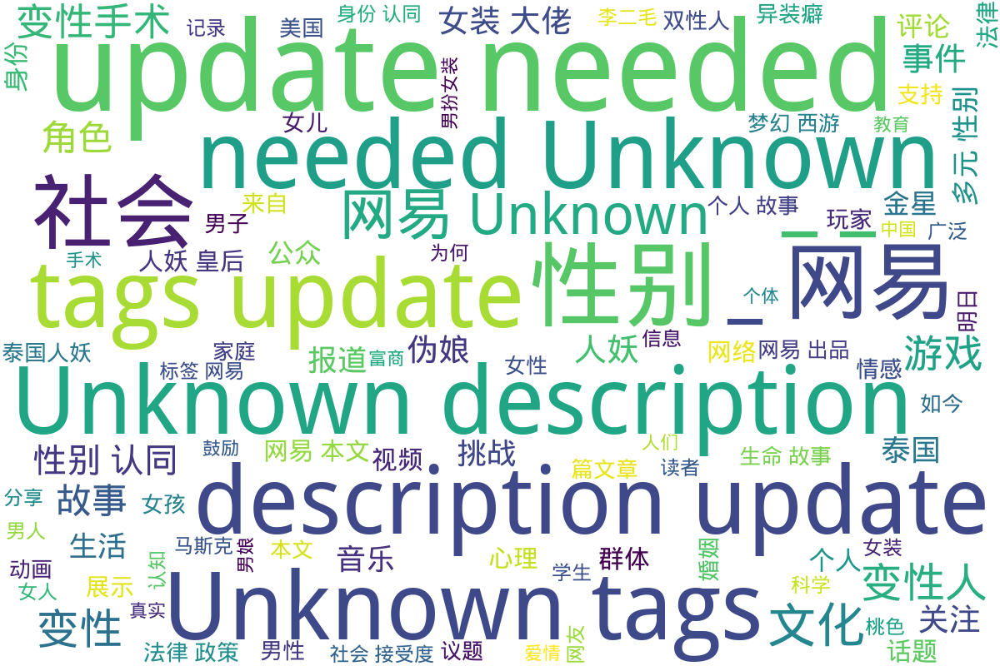

---
search:
  exclude: true
---

# 网易

该目录收录了与多元性别相关的各类内容，涵盖了变性人的生命故事、网络文化现象以及社会新闻报道。首先，包含了一位名为黄宁倩的变性人自述经历，详细描述了她心路历程和在传统婚姻中面临的挣扎。这些故事反映了社会对变性人及其性别认同进程的态度，尤其是家庭的影响。同时，对“女装大佬”这一网络现象进行了讨论，展示了跨性别表达在二次元文化中的表现，并探讨了文化背景下性别表现的多样性。此外，关于变性手术的网友评论展示了个人的过渡经历，强调了跨性别者在日常生活中遇到的挑战与成功。该目录还涵盖了一些与游戏文化相关的讨论，如游戏角色的性别表现及其在社交平台上的接受度，进一步展现了互联网时代性别认同的复杂性。

标签: `变性人`, `跨性别故事`, `女装大佬`, `网络文化`, `性别认同`, `个人经历`, `游戏文化`, `社会新闻`, `二次元文化`, `性别表现`

总计 40 篇内容

### 🌐 网页

#### 2024

[www_金星两天连发两条微博，直言爱自己，做自己，与性别无关!_-_网易](www_金星两天连发两条微博，直言爱自己，做自己，与性别无关!_-_网易.md)

查看摘要

本文记录了跨性别相关的资讯，探讨了个人对性的理解与表达。特别提到金星在社交媒体上发布的消息，鼓励每个人都追求自我，强调性别与个人实现无关。这反映了目前社会对跨性别群体的认知与支持，鼓励人们爱自己，成为自己，同时也展示了跨性别者在文化和社会环境中逐渐被接受的变化。该篇文章提供了一系列跨性别相关的文化与社会资讯，为读者提供了解当下跨性别者生活现状与表达的重要视角。

[www_金星真不冤！继广州后金星又被拒绝，佛山大剧院：太多人举报她！](www_金星真不冤！继广州后金星又被拒绝，佛山大剧院：太多人举报她！.md)

查看摘要

本文对金星在佛山大剧院演出被拒事件进行了报道，内容涉及她在广州和佛山的演出遭遇太多人举报的情况。金星作为中国知名的跨性别明星，因其个性化的艺术风格和勇敢的性别表达而受到关注。文件还提及社会对跨性别者的接受程度及相应的文化和社会反响。此报道体现了娱乐行业与跨性别权益之间的复杂关系，并反映了公众对于跨性别艺术家的看法和期待。

[money_异装癖-_标签_网易出品](money_异装癖-_标签_网易出品.md)

查看摘要

该文件主要讨论与“异装癖”相关的各种话题，包括两个主要事件的报道和相关的社会讨论。文章中提到一些令人震惊的案件，比如一名男生进入公共浴室偷拍，以及异装癖人士在社会生活中所面临的挑战和偏见。其中，涉及到的几篇文章包括：关于异装癖中学生被黑帮枪杀的事件，66岁男子因习惯捡垃圾而负债的生活态度，以及广西一位坚持穿裙子的男人的故事。还探讨了家长对孩子穿着选择的反应，尤其是对男孩穿裙子的心理压力。这些内容不仅反映了异装癖者的社会生存状况，还引发了人们对性别认同和社会接受度的深思。

[tech_跨性别-_标签_网易出品](tech_跨性别-_标签_网易出品.md)

查看摘要

该文件包含了以跨性别为主题的多个文章和视频的汇总，主要关注了跨性别者在政治、社会、文化等方面的现状和挑战。文件中的文章探讨了跨性别者在美国政治中的角色，如跨性别者当选议员以及随之而来的社会争议。同时也提到了公众对跨性别身份的不同看法，包括一些名人的发言和对事件反应的报道。此外，文件中包括了对跨性别者面临的法律和政策环境的讨论，以及一些关于跨性别者个人故事的分享。这些内容反映了美国社会对跨性别群体的态度和各种相关议题的复杂性。

[ent_变性人_标签_-_网易娱乐](ent_变性人_标签_-_网易娱乐.md)

查看摘要

该文件包含一系列关于变性人的文章，涵盖了个人故事、社会现象以及变性人面临的挑战与成就等主题。文件中列出了数个具体实例，例如变性人张克莎的生活经历，她于1983年选择变性，并最终嫁给了富商，同时对这一过程保持低调。此外，还有变性人河莉秀的现状和她的婚姻问题。文中不仅涉及个人故事，还探讨了变性文化在全球的影响，以及法律和社会环境对变性人群体的影响。整个文件内容充实，反映了变性人的生存现状及其在社会中的位置。

[money_桃色-_标签_网易出品](money_桃色-_标签_网易出品.md)

查看摘要

该文件名为“桃色”，收录了多篇与桃色事件相关的最新报道和评价，包括一些知名个体的行为及其社会影响。在文章中，包含了关于霍清舟与沈慕芸之间情感的心理剖析，以及对袁广辉与易建联桃色风波的讨论，这些事件引发了广泛的社会关注和讨论。尤其是涉及某些公众人物的桃色门事件，更是引起了媒体的热议，反映了当前社会对性与隐私的意识形态。同时，还有关于流行色和社会心理的探讨，试图从多方面理解桃色现象的形成。

[news_泰国_标签_网易出品](news_泰国_标签_网易出品.md)

查看摘要

该文件是一篇关于泰国的数字新闻报道，包含了多篇文章的摘要与链接，探讨了泰国的社会与文化现象，其中有关于跨性别者的相关内容。文章正文中提到了泰国当地的不同话题，包括中泰职教研讨、关于入境泰国的注意事项、及监拍事件等。尤其值得关注的是，文件中包含了多个与跨性别者相关的视频报道，例如关于在泰国征兵现场变性者的打扮情况，以及探讨变性者在犯法时的监禁问题等。这些内容反映了泰国社会对跨性别者的多元表现及其在社会中的地位与挑战，为研究跨性别议题提供了有价值的素材和视角。文中资料均由网易出品，并提供了多种图文并茂的案例与相关链接。

[tech_双性人_标签_网易出品](tech_双性人_标签_网易出品.md)

查看摘要

这份文件来自网易新闻，包含了一系列与双性人相关的报道和故事，集结了社会对双性人群体的关注和讨论。内容涵盖了真实故事、医学瞩目、社会现象和文化冲突等方面，有多个作者对不同话题的深入探讨。例如，有一篇关于34岁双性女性的报道，以她的生命故事为中心，描述了她是如何面对社会的偏见与挑战，并探索她的生活和情感经历。此外，文件中还记录了多个视频链接，展示了一些独特的生活案例以及双性人在法律和伦理层面上所面临的难题。通过多样的议题，文件呈现了双性人群体的复杂现实和人性关怀，旨在提高公众对这一群体的理解与接受。

[travel_变性人_标签_-_网易旅游](travel_变性人_标签_-_网易旅游.md)

查看摘要

本文搜集了一系列关于变性人的新闻报道与故事，展示了不同变性人群体的生活经历与社会现象。其中包括了知名变性人张克莎和河莉秀的个人经历，探讨了他们在个人生活与社会角色方面的转变，以及相关的医疗和心理挑战。文件中还涉及了变性人在新媒体、婚姻及社会印象中的表现，涉及法律政策、文化现象及对变性人群的接受度等话题。文章通过多篇新闻稿呈现了变性人的多样性和复杂性，附带时事新闻和法律讨论。

[comment_美国多所学校禁止学生穿洞洞鞋_网易跟贴](comment_美国多所学校禁止学生穿洞洞鞋_网易跟贴.md)

查看摘要

本文主要报道了美国多所学校禁止学生穿洞洞鞋的事件，引发了关于学生安全问题的广泛讨论。报道称，这一禁令是针对学生在校内的穿着安全考虑而实施的，引发了学校和家长之间的广泛争论。有网友在评论中提到，禁止穿洞洞鞋的规定似乎比允许变性更加引发关注，暗示了社会对穿着自由和心理健康之间的矛盾。此外，评论区中也包含了一些对洞洞鞋的轻松调侃，以及对原文出处的追问。这一事件反映了在时尚、儿童安全和多元性别认同等主题之间的复杂交集。

[m_网曝易建联出轨！女方身份被扒：疑似在新加坡留学、是跨性别者](m_网曝易建联出轨！女方身份被扒：疑似在新加坡留学、是跨性别者.md)

查看摘要

本文讨论了中国篮球界知名运动员易建联的绯闻和近日被曝出的出轨事件，焦点在于其绯闻女友身份的揭露。根据网络爆料，绯闻女主角疑似为一名变性人，同时在新加坡国立大学就读。事件引发了公众的广泛讨论和媒体的深度追踪。文件中详细介绍了事件的发展，包括网络上的截图和证据，以及易建联与其绯闻对象的背景信息。此外，对于事件的真实性、易建联的沉默回应以及公众和赞助商的反应也进行了探讨。文中引用了大量网络红人的发言及公众的猜测，揭示了事件的复杂性与社交媒体对公众人物形象的影响。总的来看，这是一篇集结了娱乐新闻、社会现象及对多元性别认知探讨的文本，展示了当下社会对跨性别者身份认同的挑战与关注。

[www_8年前，那个娶了泰国“人妖皇后”的北京男子，现在后悔了吗？_-_网易](www_8年前，那个娶了泰国“人妖皇后”的北京男子，现在后悔了吗？_-_网易.md)

查看摘要

该文件是一篇关于一位来自北京的男子与泰国“人妖皇后”结婚8年后反思和感受的报道。文章深入探讨了这段婚姻的细节以及男子在这段时间内的心理变化。通过这篇报道，读者可以了解到涉及跨性别与性别多样性的个人故事，以及对特殊关系的社会认知和接受度的讨论。内容既包括个人的反思，也涉及社会对类似关系的看法，呈现了多元性别背景下的复杂情感和社会挑战。

[www_11月3日，河南，郑州大学生夜骑自行车去开封，开封城管心疼娃们太_](www_11月3日，河南，郑州大学生夜骑自行车去开封，开封城管心疼娃们太_.md)

查看摘要

本文记录了2024年11月3日河南郑州大学生夜骑自行车至开封的事件。据报道，部分大学生在夜间骑行前往开封时遭遇疲惫，开封城管基于对学生们的关心，设立接驳点，允许学生们换乘电动车，以缓解体力透支的情况。这个事件引发了社会对大学生夜间活动及其安全的讨论，同时也反映了地方政府对年轻人出行的关心。文中配有骑自行车的大学生的图片，增强了报道的缜密性与现场感。

[www_成功的做了一场变性手术_-_网易](www_成功的做了一场变性手术_-_网易.md)

查看摘要

本文记录了一位经历了变性手术的人士的故事，探讨了变性手术的过程、心路历程以及对生活的影响。文章中提及了手术前的准备、施行手术的医院和医生的专业性，以及术后的恢复和适应情况。这段故事不仅反映了个体在性别认同上的挣扎与坚持，也揭示了社会对变性人士的态度及相关支持资源。此外，文章中包含了与变性手术相关的医疗经验、心理准备和家庭支持的重要性，为正在考虑或经历类似过程的人们提供了宝贵的参考和鼓励。

[www_特朗普胜选后，马斯克跨性别女儿宣称要离开美国_-_网易](www_特朗普胜选后，马斯克跨性别女儿宣称要离开美国_-_网易.md)

查看摘要

本文报道了埃隆·马斯克的女儿薇薇安·詹娜·威尔逊在特朗普赢得大选后宣称要离开美国的新闻。薇薇安是马斯克与前妻贾斯汀·威尔逊所生的长子，在16岁时进行了变性手术，并在18岁时法律上正式更改了自己的姓名和性别。薇薇安在社交媒体上表达了对自己在美国未来的担忧，并提及特朗普的反跨性别政策可能导致的社会环境恶化。马斯克在采访中对这一过程表达了复杂的感受，表示混乱的情况让他在疫情期间曾误以为自己支持了儿子的变性决定。此外，文章还描述了父女之间的“不和”及各自对社会和财富的看法，反映了深层的家庭和社会问题。同时，文中涉及的法律和社会变迁也突显了当前在美国对跨性别者权利的争议和讨论。

#### 2023

[comment_话题：成功的做了一场变性手术_-_网易](comment_话题：成功的做了一场变性手术_-_网易.md)

查看摘要

这是一篇关于成功进行变性手术的网友评论，来源于网易新闻。文件中包含了用户对变性手术经历的讨论与分享，特别是个人转变过程中的感受和体会。文件提到的作者是来自北京的饭饭剪影，他的内容可能涉及过渡经历，反映了跨性别者在手术过程中所经历的挑战与成功的心路历程。这篇文章不仅展示了个体的生命故事，也突显了社会对跨性别者事件的关注与讨论。值得一提的是，网页中含有网友评论，反映了公众的多元观点，这些评论是个人意见，并不代表网易的立场。

[www_男扮女装伪装成公主的我，将敌国摄政王给睡了古代小说_-_网易](www_男扮女装伪装成公主的我，将敌国摄政王给睡了古代小说_-_网易.md)

查看摘要

本文为一则古代小说，以"男扮女装的我，将敌国摄政王给睡了"为标题，讲述了一位作为和亲公主的少年在离国战败后，为了逃避权力争夺而不得不以女子身份嫁入齐国的故事。主人公因身份的秘密而生活在紧张和恐惧之中，然而在与摄政王的互动中，他们之间的关系逐渐发展。故事结合了爱情、性别身份的隐喻与古代婚姻的权谋，展现了主人公在危机中展现出的勇气与智慧。文本中有对权力斗争、家庭情感以及个人生存状态的深刻刻画，值得关注的是，小说中涉及的男扮女装及两性关系挑战了传统性别角色。

#### 2022

[c_2004年安徽一男子做手术变性，而后高调征婚，邂逅真爱生活如何？](c_2004年安徽一男子做手术变性，而后高调征婚，邂逅真爱生活如何？.md)

查看摘要

本文件记录了一位名为黄宁倩的变性人自述经历。她在2006年高调征婚的消息引起了社会的广泛关注。黄宁倩的故事涉及到她从一个名为黄恩岭的男子逐渐转变为女性的心路历程和生活经历。文件详细描述了她在父母安排下与一位女性结婚的婚姻生活，以及她内心深处苦苦挣扎的真实情感，从而导致她对自己的性别认同的质疑和最终的变性决定。文件中不仅提到黄宁倩对于变性的坚决与努力，也展现了她在追求幸福生活上所作出的努力与艰辛。同时还描述了在这一过程中她与前妻之间的关系，及其所反映的当时社会对变性人群体的普遍态度和家庭压力。整个故事用生动的案例和细腻的情感描写，使人对于多元性别与社会接受度有了更深刻的理解。

#### 2021

[www_我，26岁，性焦虑了。_-_网易](www_我，26岁，性焦虑了。_-_网易.md)

查看摘要

此文是一位26岁女性在网络平台上分享的关于自身性焦虑的真实故事。她讲述了自己在两段恋情中的亲身体验，以及这些经历如何导致了对性的焦虑感。在与前任经历中，她遭遇到来自对方的言语攻击，造成了自信心的下降，对性行为产生了恐惧和不安。在与现任男友的关系中，她勇敢地尝试沟通自己的问题，但最终因自身的焦虑而分手。文章深入探讨了性焦虑的成因，包括教育背景、心理因素等，并提供了一些积极的建议，鼓励那些经历性焦虑的人去寻求专业帮助，表示这种焦虑并不是绝症。

#### 2020

[qwq_雷蕾驾到！《非人学园》雷震子性转时装曝光_-_网易](qwq_雷蕾驾到！《非人学园》雷震子性转时装曝光_-_网易.md)

查看摘要

本文介绍了网络游戏《非人学园》中雷震子角色的性转时装‘雷蕾’的设计与特点。于2020年7月29日发布，内容详细描述了雷蕾的外观设计，表现出了角色的飘逸与中二气息，探索了如何将性别多样性融入游戏角色。文件中提到雷蕾的时装设计包括一头碧绿色的披肩长发和充满雷电图案的服饰，强调了角色在游戏中的能力与技能，展现出其作为‘天选之人’的独特身份。

内容的重点在于对角色的表现与游戏中的引雷降临的多种技能的描述，包括雷电与敌人进行对抗的场景和操作，给玩家提供了视觉与操作的双重享受。最后，鼓励玩家下载游戏以体验雷震子的形象与相关的活动，突出了角色在游戏文化中的重要性。

[www_泰国最美的人妖皇后，被中国土豪娶走，婚后生活怎样呢？_-_网易](www_泰国最美的人妖皇后，被中国土豪娶走，婚后生活怎样呢？_-_网易.md)

查看摘要

本文介绍了一位泰国的美丽人妖皇后与一位中国土豪的婚后生活，讨论了他们的爱情故事及婚后的生活细节，体现了跨文化与跨性别的特殊婚姻关系。文章插入了有关该人妖皇后的生活照片，并通过评论的方式让读者参与讨论，反映了公众对该话题的关注与多元的看法。此话题涉及对多元性别者在现代社会中的存在与接受度的探讨，以及在文化差异下的亲密关系的构建，是社会对多元性别认知与接纳的重要表现。

[www_这么可爱一定是男孩子！刷了这么多年的梗，你真的了解伪娘吗？_-_网易](www_这么可爱一定是男孩子！刷了这么多年的梗，你真的了解伪娘吗？_-_网易.md)

查看摘要

本文探讨了伪娘这一二次元文化中的独特角色，详细介绍了伪娘的定义、种类及其社会文化意义。伪娘是指那些外貌上女性化的男性角色，但在身份上仍认同为男性。文章通过对伪娘不同分类的解析，介绍了三种主要类型：普通伪娘、秀吉型伪娘和女性外表伪娘，强调了伪娘的价值与魅力。此外，文本还讨论了伪娘角色在社交中的优势，以及对待伪娘角色时需要的尊重与理解。最后，作者指出伪娘在二次元文化中的重要性以及对部分人群的吸引力，认为伪娘不仅仅是简单的角色扮演，更是对性别表达的探索与尊重。

#### 2019

[dh2_龙叔竟变身“女装大佬”？画面太美我不敢看！_-_大话西游2免费版_-_网易](dh2_龙叔竟变身“女装大佬”？画面太美我不敢看！_-_大话西游2免费版_-_网易.md)

查看摘要

该文件来自网易新闻，是一篇关于游戏《大话西游2》的文章，主要介绍了游戏内角色“龙叔”在故事情节发展中变身为“女装大佬”的精彩瞬间。文章整体氛围轻松幽默，以游戏角色间的互动和情感纠葛为主线，展现了角色之间的友情与成长。文中提到龙叔在大结局中经历的感情波折，并引发读者对角色未来故事的想象。文章还引入了游戏社交平台“网易大神”的信息，鼓励玩家与游戏爱好者互动。值得注意的是，虽然文章主要聚焦于游戏内容，但其中的性别表现与角色转变也反映了更广泛的社会文化现象，尤其是与跨性别相关的主题。

[ds_明日之后,寻找明日女神明日女神合集女装大佬篇：人家这么可爱_明日_](ds_明日之后,寻找明日女神明日女神合集女装大佬篇：人家这么可爱_明日_.md)

查看摘要

该文件是一篇关于游戏《明日之后》中的内容，具体聚焦于游戏中的女装大佬角色。文本中可能包含角色的介绍、故事背景以及在游戏中女装元素的表达。文章内容结合了评论区的讨论，读者在评论中火热讨论女装大佬的形象与角色定位，体现了玩家对于女装文化的认知与接受程度。整体来看，这篇文章在一定程度上反映了跨性别或性别流动性的话题，同时与现代网络文化，尤其是在游戏社区中的表现形式密切相关。

[ds_新衣服配我的女装大佬脸竟然…比想象中好一点_明日之后_大神](ds_新衣服配我的女装大佬脸竟然…比想象中好一点_明日之后_大神.md)

查看摘要

这篇文章来自于游戏《明日之后》的大神社区，由用户甜如蜜糖于2019年9月26日发布。文章内容围绕关于游戏中的新衣服搭配与角色形象讨论，其标题为《新衣服配我的女装大佬脸竟然…比想象中好一点》。作者分享了自己穿着游戏中一件雪山棉袄的感受，并对其配搭的相关家具与场景设计进行了个人评价，表达了对于角色形象设计的喜爱与安全感，幽默地提到了自己在空调底下穿着的舒适体验。文章还全部包含了一些游戏内的攻略标签，引导玩家如何更好地搭配角色形象，展示了虚拟世界中跨性别表达的可能性与个人自信。

#### 2018

[c_你讨厌女装大佬吗？你觉得他的存在合理吗？_-_网易新闻](c_你讨厌女装大佬吗？你觉得他的存在合理吗？_-_网易新闻.md)

查看摘要

本文探讨了“女装大佬”这一网络文化现象，介绍了其起源及在二次元文化中的表现，尤其是在cosplay活动中男生反串扮演女性角色的现象。文件中提到，‘女装大佬’这一称呼最早出现于2016年，评论其可爱与酷炫的外表，同时展示了几个相关的形象照片，提供了轻松幽默的评论。作者从个体体验出发，对这一现象表达了个人的看法，既有趣又略带戏谑。这个话题反映了当代社会对性别表达多样性的包容与挑战。

#### 2014

[kids_15岁女孩要变性做男人_-_网易教育](kids_15岁女孩要变性做男人_-_网易教育.md)

查看摘要

本文讲述了一名15岁女孩的跨性别经历，她希望能通过变性手术成为男性。文章强调了这位青少年的心理状况及其对性别身份的认同过程，同时提供了相关的心理支持和社会环境背景。通过这篇文章，读者能够了解到跨性别青少年所面临的挑战与困境，包括家庭、社会的反应以及内部的心理挣扎。作者通过这个个体故事，试图引发公众对跨性别群体的关注与理解，推动社会对性别认同的包容与支持。

#### 2009

[xyq_爱情从人妖开始-_《梦幻西游》电脑版官方网站_-_网易](xyq_爱情从人妖开始-_《梦幻西游》电脑版官方网站_-_网易.md)

查看摘要

该文件来源于《梦幻西游》电脑版官方网站，标题为《爱情从人妖开始》。文件中包含一些游戏画面和礼包信息，主要围绕游戏社交圈的构建。文章开头提到网易大神是一个汇聚精英玩家和行业大咖的社区，旨在为玩家提供一个丰富的社交互动平台，以游戏为媒介，结交朋友，分享游戏经验和乐趣。该文件对跨性别群体的关注体现在对‘人妖’这一用词的使用，然而具体对其经历的描写和支持资源并不明显。整体上，这篇文章主要是对游戏内容和玩家社群的推广，并未深入探讨爱情与性别认同之间的复杂关系。

[xyq_人妖的定义_-_梦幻西游-_网易](xyq_人妖的定义_-_梦幻西游-_网易.md)

查看摘要

本文讨论了“人妖”的定义，来源于游戏《梦幻西游》。作者ccxxzz通过一句富有哲理的话，以幽默的方式探讨了人和妖的区别，强调仁慈之心的重要性。他引用了唐三藏的话，表达了人和妖之间的相似性，以及如何通过仁慈之心使妖也能拥有较高的道德标准。文中提到的观点引发了人们对跨性别群体的思考，让人们反思在社会环境中对跨性别者的态度。这篇文章除了讲述定义，更是一种对文化和身份认同的深刻反思。

#### 2006

[xyq_人妖怎么了!_-_梦幻西游-_网易](xyq_人妖怎么了!_-_梦幻西游-_网易.md)

查看摘要

本文讨论了“人妖”这一词汇在社会文化中的使用和含义。文章通过《梦幻西游》这一广受欢迎的游戏作为背景，探讨了跨性别人士在网络游戏和更广泛社会中的身份、表现与接纳问题。内容中提到，人妖形象在某些文化中被商品化，且有着复杂的社会认知。尽管文章的作者信息未被明确指出，但可以看出其内容旨在引发对跨性别话题的关注和讨论。

#### 2005

[tech_科普要闻_科学频道](tech_科普要闻_科学频道.md)

查看摘要

该文件来自网易科学，主要收录了2005年1月18日至19日间的科学频道重要科普内容。文件中包含多篇科学新闻报道，涉及生物物种的流失情况、生态保护的法律问题、以及新科技的开发等。尤其提到了一篇与跨性别相关的报导："易性癖"男女比例约三比一，中国十万人想变性。这提醒我们跨性别议题如何与社会和科学交织在一起。同时，文件也包括一些引人注目的科学发现和技术进展，比如关于南极冰盖的科研及人类首次登上南极副高点的成就，体现出科学研究在不同领域带来的影响。

#### 2004

[news_在爱情夹缝里的人社会新闻周刊](news_在爱情夹缝里的人社会新闻周刊.md)

查看摘要

本文为社会新闻周刊的一篇报道，着重讨论了变性人在社会中的经历与挑战，揭示了从歧视到逐步接纳的社会演变。文章开头指出，变性人逐渐能够在公众面前发声，例举了变性人雷莫的悲剧故事，讲述了他因为社会压力和内心挣扎而选择自杀。这一案例为文章增添了情感深度，让读者对变性人所经历的心理痛苦有更深入的了解。同时，在对变性人的描写中，提及了金星等知名变性人的故事，展现了变性个体的坚强与追求理想的决心。文章还探讨了变性所面临的社会和伦理问题，例如变性人的婚姻状况及对社会传统道德的挑战。整篇报道通过多个变性人的故事，呈现了他们在寻求身份认同和社会接纳中的挣扎与努力。

#### 时间未知，按收录顺序排列

[m_这部动画的男主角最爱穿女装，第一次约会把妹子吓得够呛_-_网易](m_这部动画的男主角最爱穿女装，第一次约会把妹子吓得够呛_-_网易.md)

查看摘要

这篇文章讨论了关于日本动画《埃罗芒阿老师》第8话及其相关的文化现象，文中提到了一些与动画无关但反映网络现状的故事，比如网络用户的虚假自夸。此外，文中也涉及了4月春季番剧的人气声优投票结果，以及即将播出的与性别表达相关的动画《裙子里面是野兽》。该文通过动画作品展示了跨性别与性别表达的不同侧面，同时引发了关于社会文化及网络现象的讨论。

[kids_15岁女孩要变性做男人](kids_15岁女孩要变性做男人.md)

查看摘要

本文讨论了一名15岁女孩希望通过变性手术转变为男性的故事，反映了跨性别者在成长过程中的真实挑战与选择。此案例体现了当代青少年对性别认同的探索及其所面临的心理压力与社会环境。文章来源于网易教育，或许是针对跨性别群体的声音进行探讨，以期引发社会对性别认同及其转变过程的关注与理解。尽管具体内容尚未给出，标题本身就引起了人们对跨性别议题的关注与话题讨论。

[ds_大神男娘](ds_大神男娘.md)

查看摘要

该文档收录了与“男娘”相关的多条信息，内容主要是来自于游戏《永劫无间》和《光·遇》中的玩家互动，这些互动包括了玩家的个人分享、绘图和讨论，涉及到角色扮演的表达和外观展示。文中包含多位用户的评论与对话，讨论话题主要集中在“男娘”、“伪娘”的文化和相关的标签。这些内容展示了当前年轻人对性别表达的多样性，以及网络游戏如何成为社交与性别认同的一个重要平台。

[music_ひまわりの約束高清版-_秦基博-_高清MV_-_网易云音乐](music_ひまわりの約束高清版-_秦基博-_高清MV_-_网易云音乐.md)

查看摘要

本文档包含了一段音乐视频的信息，主要介绍了歌曲《ひまわりの約束》的高清版。文中提供了关于视频的基本介绍，播放时长为00:00，且显示了默认的专辑封面图片。文中还列出了一系列与网易云音乐相关的链接和功能，包括音乐发现、我的音乐、商城等。此外，评论区显示该音乐已添加到播放列表，但具体作者和版权信息均未指明，归档中标记为无。这份文档并没有直接涉及跨性别主题，而是以音乐为主导内容，适合于音乐爱好者或对该曲目感兴趣的听众。

[music_「人妖」李二毛的一生_-_网易云音乐](music_「人妖」李二毛的一生_-_网易云音乐.md)

查看摘要

该文件记录了李二毛的一生，他是一位跨性别者，经历了诸多挑战与变化。在成长过程中，李二毛遭受了来自社会、家庭以及个人的各种困难与压力，反映了跨性别者在社会中面对的偏见与艰辛。在李二毛的故事中，我们不仅能看到他个人的奋斗历程，更可以理解跨性别群体在寻求认同与接受过程中的复杂情感与生存状态。此文提醒我们关注跨性别者的生存现状以及他们的真实经历，是一部具有深刻社会意义的作品。这一内容是通过故事FM平台传播，旨在增加社会对性别多样性与人权问题的认识。

[m_泰国人妖韩国娘炮日本废宅，为啥有美国驻军的国家，都快速娘化？](m_泰国人妖韩国娘炮日本废宅，为啥有美国驻军的国家，都快速娘化？.md)

查看摘要

这篇文章探讨了泰国人妖、韩国娘炮和日本废宅在美国驻军国家中迅速"娘化"的现象。作者史小纪通过对这些现象的观察与分析，提出了此类文化现象背后的深层原因，涉及社会、文化与性别认同的复杂交织。文章的正文部分未显示具体内容，但从标题可见，讨论的重点集中在性别表现和文化影响力等方面。作者认为，这种现象不仅反映了社会对性别和文化认同的变化，也揭示了外部军事存在对当地文化的渗透与改变。

[music_谁说J家不出女团？！向女装大佬们低头！！_-_视频-_网易云音乐](music_谁说J家不出女团？！向女装大佬们低头！！_-_视频-_网易云音乐.md)

查看摘要

本文讨论了日本的偶像文化，特别是女团的形成和发展，强调了对于多元性别表达的包容性。文章中提到了一些流行的女装大佬，称赞他们通过个人风格展示对性别表达的挑战和突破。在视频内容中，可能包含了相关的音乐表演或舞蹈片段，体现了这些艺术形式如何与多元性别话题相结合。文章呼吁对这些艺术表现形式给予更多的尊重与认可。

[open_昔日发小整容变性，摇身一变成了女朋友，这部韩国悬疑片绝了](open_昔日发小整容变性，摇身一变成了女朋友，这部韩国悬疑片绝了.md)

查看摘要

本文探讨了一部韩国悬疑片的情节，涉及一个人物通过整容和变性重塑自我的故事。文章通过讲述一名男性朋友在手术后变为女性的过程，描绘了其身边朋友对这场变化的羡慕与难以接受。影视作品通过悬疑元素探讨了身份认同、社会接受度以及性别流动性等多元性别议题，使得观众在观看的同时产生深思。此外，文章提及了相关的社会反响，吸引了观众对性别与身份相关性的关注。

### 词云图 { data-search-exclude }

> 目录及摘要为自动生成，仅供索引和参考，请修改 .github/ 目录下的对应脚本、模板或对应文件以更正。
